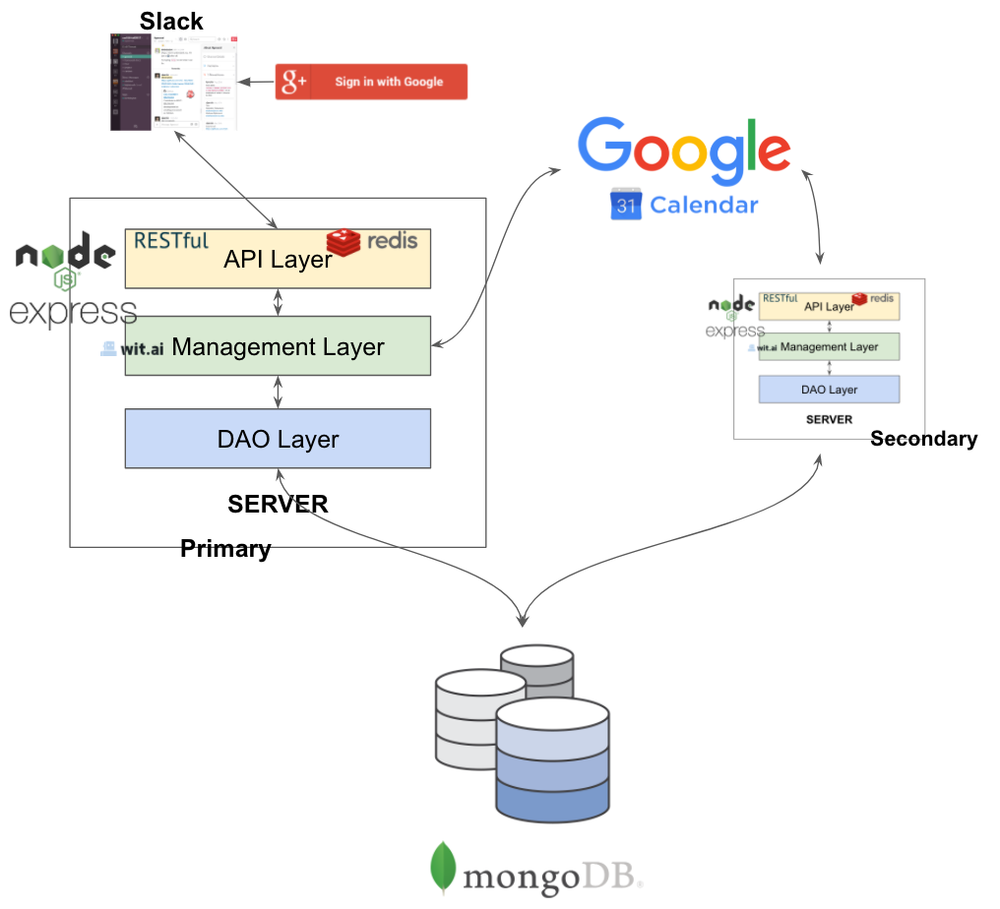

## Use Cases:
The use cases have been designed to cover the CURD functionality alongwith the additional feature of being able to send a reminder to the attendees.
```
Use Case 1: Create a meeting
1 Preconditions
   All the participating users must have Google Calendar API tokens in the system.
2 Main Flow
   User will request a meeting to be setup with a list of attendees [S1]. Bot suggests possible meeting times after conflict resolution [S2]. The user will confirm one time slot to the Bot [S3]. Bot creates meeting and posts the link to the event [S4].
3 Subflows
  [S1] User gives command to setup a meeting - @bot setup meeting with @user.
  [S2] Bot returns a list of possible meeting times after conflict resolution.
  [S3] User confirms one time slot from the list.
  [S4] Bot creates a meeting for that particular time slot and posts the link to Google Calendar Event.
4 Alternative Flows
  [E1] Meeting cannot be set as no team members are available.
```

```
Use Case 2: Swap a meeting with another meeting
1 Preconditions
   All the participating users must have Google Calendar API tokens in the system.
2 Main Flow
   User will request a meeting to be swapped with another meeting [S1]. Bot checks for conflicts with the new timings for the users involved in both the meetings and suggests possible times [S2]. The user confirms the time slots [S3]. Bot creates the meeting and posts the link to the event [S4].
3 Subflows
  [S1] User gives the command to swap two meetings - $bot swap my 2pm meeting today with 4pm meeting tomorrow.
  [S2] Bot returns a list of possible meeting times for both the meetings in case of conflicts or asks for a confirmation if there's no conflict.
  [S3] User chooses possible times for both the meetings and confirms to the Bot.
  [S4] Bot swaps the meetings and posts the link for both the events.
4 Alternative Flows
  [E1] Meeting cannot be swapped because of conflicts.
```


## Architectural Design:



* **UI & Client**
  - **#Slack**: The UI for the bot resides in [Slack](https://slack.com/features), which is a cloud based chat app which is typically used by members of a Software Engineering Team. Members can communicate with each other through common chanels or direct messaging. An interesting feature in slack is the provision to add external tools and bots capable of aiding members of the slack team. Few common examples of bots are [WeatherBot](https://slack.com/features), [a list of TODOs](https://ai-se.slack.com/apps/A0HBTUUPK-to-do). Each member of the team needs to register with the bot to assist him/her in creating conflict free meetings.
  - **Google Signup**: Each member while registering with the bot will signup with his/her Google Account via the [Google OAuth UI](https://developers.google.com/google-apps/calendar/auth). This is to enable access to his/her calendar to check for meetings, resolve conflicts and schedule them once resolved.
* **Server**
  The Server is a [REST](https://en.wikipedia.org/wiki/Representational_state_transfer) built using the following technologies
  - **Node**: [Node](https://nodejs.org/) is an asynchronous event driven JavaScript runtime framework which primarily is used for server side programming and is one of the first frameworks to break the notion of JavaScript as a client side programming language.
  - **ExpressJS**: [ExpressJS](https://expressjs.com/) is an additional minimal framework on Node primarily for web based applications that reduces and simplifies REST based calls and caters to an [MVC](https://en.wikipedia.org/wiki/Model%E2%80%93view%E2%80%93controller) architecture.
  
  Since the server is the layer of the framework with most fuctionality, we granularize it into three essential components based on its responsibilities. This further complies with the *Template Design Pattern* where there is placeholder for each layer and each layer which can be chosen based on the developers just has to adhere to the template's placeholder.
  - **API layer**: To and from communications with the client happens in this layer.
    - ***REST***: The API for this layer is exposed via REST which allows the client to communicate with the server via HTTP requests. The choice of REST was made over other contemprories like [SOAP](https://en.wikipedia.org/wiki/SOAP) and [GraphQL](http://graphql.org/) due to the following reasons
      * **Stateless**: Since REST is stateless, it makes each request to the server independent of each other thus limiting the data shared and additional bookkeeping.
      * **HTTP based**: Since REST is built on HTTP, it enables users to follow standard HTTP methods like *GET*, *POST* etc and easier validation over the webbrowser.
    - ***Caching***(optional): This is an optional feature we plan on implementing if the base features of our project is completed on time. Here we cache the frequent requests made by the user using [MemCache](https://www.npmjs.com/package/node-cache) or [Redis](https://redis.io/) to help the user with auto complete and thus give him a better chat experience.
  - **Management layer**: This layer is primarily responsible for data Processing and the business logic of the application.
    - ***Wit.ai***: [wit.ai](https://wit.ai/) takes in text or voice and extracts intents and entities from them. It helps in parts of speech recognizing and semantic parsing of the text which can be further used to power the business logic of the application.
    - ***Google Calendar API***: [Google's calendar API](https://developers.google.com/google-apps/calendar/) gives access to a registered user's google calendar. The calendar can be accessed via REST calls.
    - ***Business Logic***: Intent extracted from the text and corresponding data fetched from the Google Calendar API is used to help create meetings and automatically resolve conflicts based on the schedules of the participants. 
  - **DAO layer**: Database Access Object(DAO) layer is responsible for interactions of the server with the database. This layer is responsible for access the database for fetching and updating the information. This is again an implementation based on the Template Design Pattern coupled with the Singleton Design Pattern.
    - ***Template***: This allows us to plugin a different choice of database by simply changing the connector.
    - ***Singleton***: Only a single instance of the database connector should exist to ensure that the write lock on the database is maintained such that the consistency of the database is not violated.
* **Database**
  - **MongoDB**: The choice of the database is a NoSQL key value store primarily because 
      1. It ensures flexibility of storage 
      2. More of a temporary store during the period of conflict resolution 
      3. Good community support with NodeJS
* **Deploy**
  The server and database would be deployed on [digitalocean](https://www.digitalocean.com/) which is part of the [github student plan](https://education.github.com/pack). Each container will be run on Linux Ububtu 16.04 and will be independent of each another
  - Database Container: The database will have an independent container such that if the server goes down the database should not be affected.
  - Primary Server: Container runnning the master instance of the server stack. This will be the server addressing all the requests from the client.
  - Secondary: Container runnning the slave instance of Server. This will act as a back up to the primary server and if the primary server goes down, it will become the primary server.
  
  
